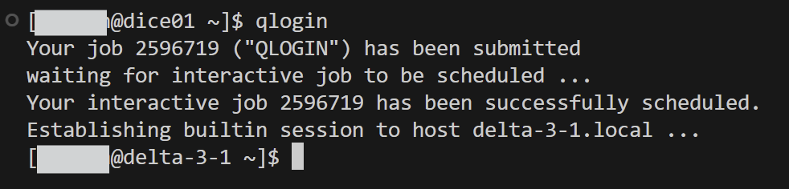
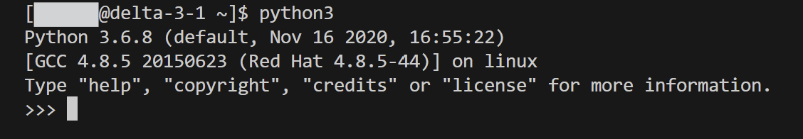
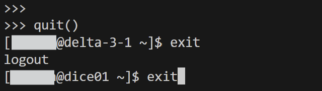

# Garvan: Request interactive session
This document is a simple walk-through that shows how an interactive session is requested and used on Garvan's on-site HPC platforms.

**Source documents:**

TBD

## Wolfpack
### Login on the login node
```shell

# Login to Wolfpack HPC

ssh -i <your-SSH-key> <your-username>@dice01.garvan.unsw.edu.au

```

### Request an interactive session from the scheduler

```shell

# Request an interactive session

qlogin

```
### Wait for interactive session to start
On Wolfpack, interactive sessions will start almost instantly!

### Interactive session starts



### Start R/Python/Julia/Perl...etc.



### Exit interactive session and logout

