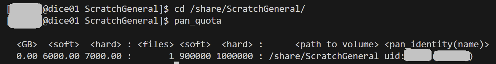

# Garvan: Site limits
This document collects all salient limits that you will be subjected to when using the on-site HPC.

**Source documents:**

https://intranet.gimr.garvan.org.au/display/DSP/HPC+Storage
## Wolfpack
### Storage limits
```shell

# Show the limits for the current working directory

pan_quota

# Show the limits for a scratch location

cd /share/ScratchGeneral
pan_quota
```


### Job size and time limits
**General user:** 100 cpu-cores, 1000 GB, TBD hours


### Interactive usage limits
**Default:** 1 cpu-core, 7.8 GB, 8 hours
