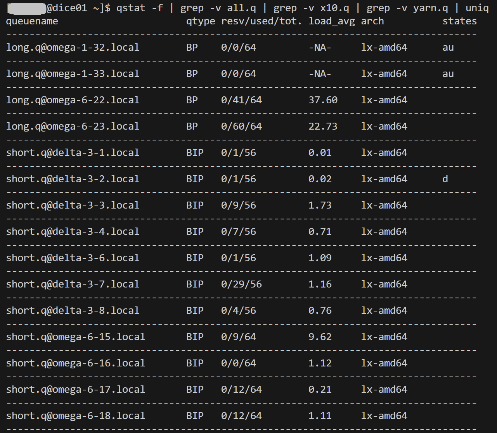
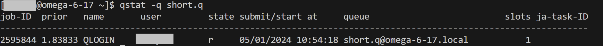
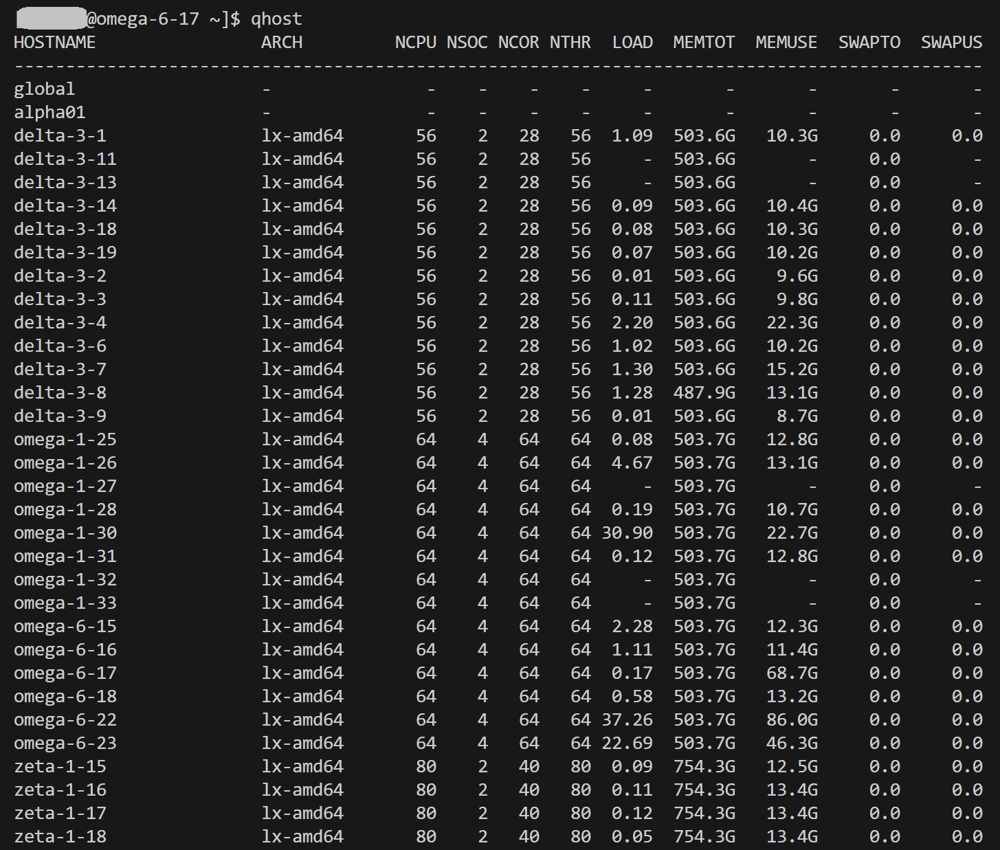

# Garvan: Site queues
## Wolfpack
```shell

# Login to the Wolfpack HPC

ssh -i <your-SSH-key> <your-username>@dice01.garvan.unsw.edu.au
```
```shell

# Show all the queue names

qconf -sql

# Show details of queues that are commonly used

qstat -f | grep -v all.q | grep -v x10.q | grep -v yarn.q | uniq

# The returned column 'queuename' has this format: 
#
#    queue@node
```


| qtype (queue type) | Details |
| ---- | ---- |
| B | Batch |
| I | Interactive |
| C | Checkpointing | 
| P | Parallel |

| states (queue states) | Details |
| ---- | ---- |
| d | disabled |
| a | alarm |
| E | Error |
| s | suspended |
| u | unknown |

```shell

# Show more details of a specific queue 

qstat -q short.q
```


```shell

# Show the details of a specific node that is part of a queue

qstat -q short.q@omega-6-17.local
```
```shell

# Show the capabilities of all the compute nodes in the system

qhost
```

```shell

# Logout 

exit
```
