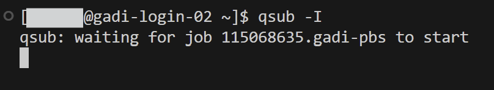
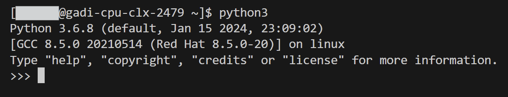
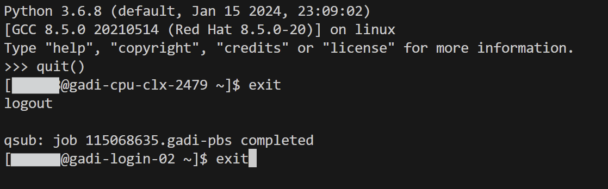

# NCI Gadi: Request interactive session

### Login on the login node
```shell

# Login to Gadi HPC

ssh -i <your-SSH-key> <your-username>@gadi.nci.org.au

```

### Request an interactive session from the scheduler

```shell

# Request an interactive session

qsub -I

```
### Wait for interactive session to start
On Gadi, interactive sessions can take a few minutes to start!

### Interactive session starts

### Start R/Python/Julia/Perl...etc.

### Exit interactive session and logout
