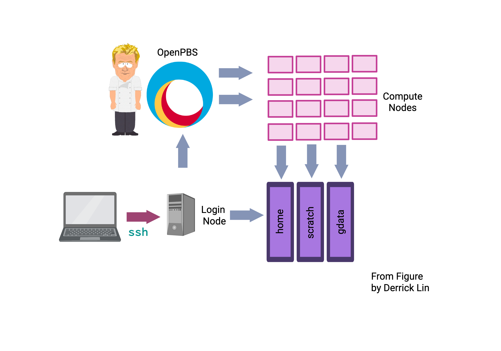

Setting Up on NCI Gadi
=====================

Objectives 
- Open an operating system-specific terminal
- Log in to the NCI Gadi server

Welcome!

When bioinformaticians run a pipeline to discover a pathogenic variant, they need to consider the computational demands of the pipeline. There are two common options for running the pipeline:

a. Locally on their laptop.

b. Using a high-performance computer (HPC).

The HPC we will use is Gadi, from the National Computational Infrastructure (NCI), which is a cluster of computational resources designed for running computationally intensive and advanced computational problems, such as discovering a pathogenic variant.

To interact with the NCI, we will use an operating system-specific program on your laptop. Gadi is a shared computational cluster, and we will be using Bash, a language that interacts with the Linux operating system found on the Gadi cluster.

Mac users can use the Terminal program. 

- For **Mac** users, you can use the Terminal program. You can open it by spotlight searching "Terminal." Alternatively, you can use [iTerm2](https://iterm2.com/), which is a macOS terminal replacement that I prefer.
- **Windows** users:
 - First, check if you have the Command Prompt or PowerShell program locally. You might need to enable SSH using the tutorial recommended by John Reeves: [How to Enable and Use Windows 10's Built-in SSH Commands.](https://www.howtogeek.com/336775/how-to-enable-and-use-windows-10s-built-in-ssh-commands/). 
 - Second, if you do not have either Command Prompt or PowerShell installed, it is likely that your laptop has a Windows OS version before 10. Therefore, I recommend installing [Putty](https://www.putty.org/), an open-source software. 

For many of you, this is your first time using UNIX. As with all bioinformatics, the best way to learn is by trial and error. There is little that you can do wrong, with one important caveat:

**Please Read!**
 Unix has  **no undo**  function. If you  **delete or overwrite**  a file, it will be gone forever! As a result, you should:
 1.    Keep  **backup copies**  of important files.
 2.    Be  **very careful**  with the command rm ("remove", i.e. delete) and any commands to move/create files that might over-write something important (mv, cp and redirecting output with \> and \>\>).
 3.    Use  **rm -i**  to provide an additional safety check against rogue deletion.
 4. Make sure that you keep good notes. Ultimately, it should be fairly straightforward to regenerate anything from the starting data, provided you have adequate records of how you made it in the first place. This is one of the primary goals of keeping a lab book.

The issue is that Microsoft Word and other traditional text editors do not format code properly. So when writing code, please use a GUI such as [Visual Studio Code](https://vscode.dev/). This is the web interface version. However, there is a Desktop version available (https://code.visualstudio.com/). This makes for a much more seamless integration, and if you want to include the HPC, you can add extensions by following this [blog post](https://blog.wytamma.com/blog/hcp-vscode/).


**The caveat of using different operating systems on different computers.**
It is not possible to write this website with clear instructions for all combinations of computers and software. As such, the website will be written as if you are using a Mac laptop. Please let us know if you are experiencing technical issues through the Slack channels, and we will try to help where we can. Key differences include different commands and forward and backslashes when utilising the Windows OS. 

**The importance of real estate.**
 One thing you will quickly learn is the importance of being able to see clearly what you are doing. This generally means making the Putty/Terminal window much bigger than it opens by default. Ideally, you want it wide enough to avoid long commands and/or screen output wrapping onto multiple lines. You also want to see as many lines as possible to keep track of the context of what you are doing, and to make sure that important messages (particularly errors) do not disappear off the top of the screen. The precise way to resize your window will depend on your computer/software combination, but you can't find out how.


### Logging on

You log on to the server using your **username** and a program that lets you connect via a "secure shell (SSH)".  If you use a Mac, open the **Terminal**. Terminal is generally found in the "Other" folder in Launchpad, or search for "Terminal" with Spotlight. Once open, **Keep in Dock** for handy future access. If using Windows, either open PowerShell or PuTTy as mentioned previously.


Above is a schematic that displays the setup of NCI Gadi. We will explain the complicated part of the diagram concerning volumes and compute nodes in future sessions. What we are doing is the first pink arrow, logging in to the **login** nodes. Gadi has 10 login nodes that serve users in a round-robin fashion, which will be randomly allocated when you `ssh` as below.

To log on from Mac OSX (or a UNIX machine), open the Terminal and type at the prompt (replacing username with your own **username** ):

```
$ ssh username@gadi.nci.org.au
```

Change the **username**. 

**NOTE:** You will also find life easier with a bigger monitor – use the biggest screen/resolution possible, especially when working with anything graphical.

**NOTE:** For security reasons, you will not see anything appear on-screen when typing your password. Please be sure to trust that it is registering and hit **ENTER** when complete.


## NCI Gadi Garvan help pages
Tim Ho and other members of the DSP Pillar team have assembled the NCI section of the [Garvan Intranet](https://intranet.gimr.garvan.org.au/spaces/DSP/pages/419005260/NCI+Gadi), which is very helpful. For example, this section regarding the login node:

The login node is a single point of access that is primarily designed to allow users to:

1. Log into the system
2. Set up software
3. Configure pipelines / compute jobs
4. Run and monitor compute jobs
5. Run quick tests
6. The login nodes should never be used for running real compute jobs.

To encourage fair use of the shared resources and ensure system stability, there are shell limits enforced for processes on the login nodes:

- 30 minutes cumulated CPU time (note: not wall time)
- 4 GB memory usage

When a process uses more than the above resources, that process will be automatically terminated. 

**The shell limits also apply to data transfer and data checksum operations, which means that long data transfers will be terminated if the transfer process (e.g. rsync, rclone, scp, md5sum, etc.) exceeds the limits.**


 
### Logging off

To log off the server, close the window or type:

```
$ exit
```
 
### What happens if the internet connection fails?
Whenever working with servers, there is always the risk that something will go wrong. Fear not! We have contingencies (and backup data) in place if something goes wrong. 


**Time Saving Shortcuts**

If you have extra time, here are some things to do to make your login and navigating around your user login easier. 

1) [Login without using SSH without a password](https://www.thegeekstuff.com/2008/11/3-steps-to-perform-ssh-login-without-password-using-ssh-keygen-ssh-copy-id/)
   
2) [Form a symbolic link for your scratch location. This means that instead of having to write out the entire location, you can have a fake folder ](https://www.faqforge.com/linux/create-shortcuts-in-linux-symbolic-links/)

3) [Edit your bashrc file (this is more complicated and not recommended until you are comfortable with UNIX)](https://docs.rc.fas.harvard.edu/kb/editing-your-bashrc/)

4) If you want to make your script writing and submitting more seamless between your console and ssh. Depending on your machine, you can ssh into your machine via VSCode and submit directly. The how-to steps are as follows:
    
 - Install the remote-ssh extension from the marketplace (https://code.visualstudio.com/docs/remote/ssh)
 - Connect to NCI-Gadi through VSCode using their login
 


Adapted from Handbook by RJ Edwards and John Reeves help-page.
