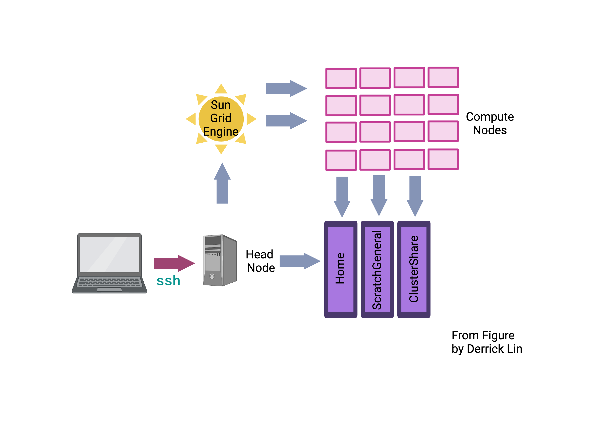

Setting Up on Wolfpack
=====================

Objectives 
- Open operating system specific terminal
- Log in to the Garvan wolfpack server

Welcome!

When bioinformaticians run a pipeline to discover a pathogenic variant, they need to consider the computational demands of the pipeline. There are two common options for running the pipeline:

Running it locally on their laptop.
Using a high-performance computer (HPC).
The HPC at Garvan is called the Wolfpack, which is a cluster of computational resources designed for running computationally intensive and advanced computation problems like discovering a pathogenic variant.

To interact with the Wolfpack, we will use an operating system-specific program on your laptop. The Wolfpack is a shared computational cluster, and we will be using Bash, which is a language that interacts with the Linux operating system found on the Wolfpack cluster.

Mac users can use the Terminal program. 

- For **Mac** users can use the Terminal program. You can open it by spotlight searching "Terminal." Alternatively, you can use [iTerm2](https://iterm2.com/), which is a macOS terminal replacement that I personally prefer.
- **Windows** users:
 - First, check if you have the Command Prompt or PowerShell program locally. You might need to enable SSH using the tutorial recommended by John Reeves: [How to Enable and Use Windows 10's Built-in SSH Commands.](https://www.howtogeek.com/336775/how-to-enable-and-use-windows-10s-built-in-ssh-commands/). 
 - Second, if you do not have either Command Prompt or PowerShell installed, it is likely your laptop has a Windows OS before 10. Therefore, I recommend installing [PuTTY](https://www.putty.org/) which is an open source software. 

For many of you, this is your first time using UNIX. As with all bioinformatics, the best way to learn is by trial and error. There is little that you can do wrong, with one important caveat:

**Please Read!**
 Unix has  **no undo**  function. If you  **delete or overwrite**  a file, it will be gone forever! As a result, you should:
 1.    Keep  **backup copies**  of important files.
 2.    Be  **very careful**  with the command rm ("remove", i.e. delete) and any commands to move/create files that might over-write something important (mv, cp and redirecting output with \> and \>\>).
 3.    Use  **rm -i**  to provide an additional safety check against rogue deletion.
 4.     Make sure that you keep good notes. Ultimately, it should be fairly straight-forward to regenerate anything from the starting data, provided you have adequate records of how you made it in the first place. This is one of the primary goals of keeping a lab book.

## Setting up the Garvan VPN

To access the servers off-campus, you will need to set up the Garvan Virtual Private Network (VPN), which gives you access to Garvam resources off-site as if you were on-site. Details to set this up can be found with two simple tutorials.

1. Setting up single sign-on multifactor authentication setup using [this tutorial](https://intranet.gimr.garvan.org.au/display/ithelp/Single+Sign-On+Multifactor+Authentication+Setup)
2. Configuring single-sign on vpn configuration using [this tutorial](https://intranet.gimr.garvan.org.au/display/ithelp/Single+Sign-On+VPN+Configuration).

Please contact Garvan IT (ithelp@garvan.org.au) if you have questions or experience problems with the VPN. If you have recurring issues, please let the me know. 

**The caveat of using different operating systems on different computers.**
It is not possible to write this website with clear instructions for all combinations of computers and software. As such, the website will be written as if you are using a Mac laptop. Please let us know if you are experiencing technical issues through the slack channels and we will try to help where we can. Key differences include different commands and forward and backslashes when utilising Windows OS. 

**The importance of windows real estate.**
 One thing you will quickly learn is the importance of being able to see clearly what you are doing. This generally means making the Putty/Terminal window much bigger than it opens by default. Ideally, you want it wide enough to avoid long commands and/or screen output wrapping onto multiple lines. You also want to see as many lines as possible to keep track of the context of what you are doing, and to make sure that important messages (particularly errors) do not disappear off the top of the screen. The precise way to resize your window will depend on your computer/software combination, but seek some advice during a prac session if you cannot find out how to do it.


### Logging on

You log on to the server using your **username** and a program that lets you connect via a "secure shell (SSH)".  If you use a Mac, you simply need to open the **Terminal**. Terminal is generally found in the "Other" folder in Launchpad, or just search for "Terminal" with Spotlight. Once open, **Keep in Dock** for handy future access. If using Windows, either open PowerShell or PuTTy as mentioned previously.


Above is a schematic that displays the setup of the Wolfpack. We will explain complicated part of the diagram concerning volumes and compute nodes in future sessions. What we are doing is the first pink arrow, loggin into the **login** nodes dice01.garvan.unsw.edu.au	or dice02.garvan.unsw.edu.au	.


To log on from Mac OSX (or a UNIX machine), open the Terminal and type at the prompt (replacing username with your own **username** ):

```
$ ssh username@dice01.garvan.unsw.edu.au
```

Change the **username**. 

**NOTE:** You will also find life easier with a bigger monitor – use the biggest screen/resolution that you can, especially when working with anything graphical.

**NOTE:** For security reasons, you will not see anything appear on-screen when typing your password. Trust that it is registering and hit **ENTER** when complete.

**Logging on from outside the Garvan.**
 Remember that to log on from outside Garvan, you will need to connect to the virtual private network (VPN).
 

 
### Logging off

To log off the server, simply close the Putty window or type:

```
$ exit
```
 
### What happens if the server fails?
Whenever working with servers, there is always the risk that something will go wrong. Fear not! We have contingencies (and back up data) in place in case something goes wrong. 


**Saving your session and sanity with screen.**
 Whenever doing anything that will take a while, it is recommended that you use a utility called "screen", which will maintain an active session even if you log out or your connection to the server is dropped. You can read more about screen in the **Using screen (Advanced)** section after UNIX basics. The core elements are:

1. To start a new screen called "myscreen": screen -S myname

2. To "detach" the screen so you can re-attach it later and pick up where you left off: ctrl+a » d

3. To re-attached the screen "myname" after logging back on: screen -dr myname


**Some Time Saving Shortcuts**
If you have any extra time here are a couple of things to do to make your login and navigating around your user login easier. 

1) Login without using ssh without a password (https://www.thegeekstuff.com/2008/11/3-steps-to-perform-ssh-login-without-password-using-ssh-keygen-ssh-copy-id/)
2) Form a symbolic link for your scratch location. This means that instead of having to write out the entire location, you can have a fake folder (https://www.faqforge.com/linux/create-shortcuts-in-linux-symbolic-links/)
3) Edit your bashrc file (this is more complicated and not recommended until you are comfortable with UNIX) (https://docs.rc.fas.harvard.edu/kb/editing-your-bashrc/)


Adapted from Handbook by RJ Edwards and John Reeves help-page.

