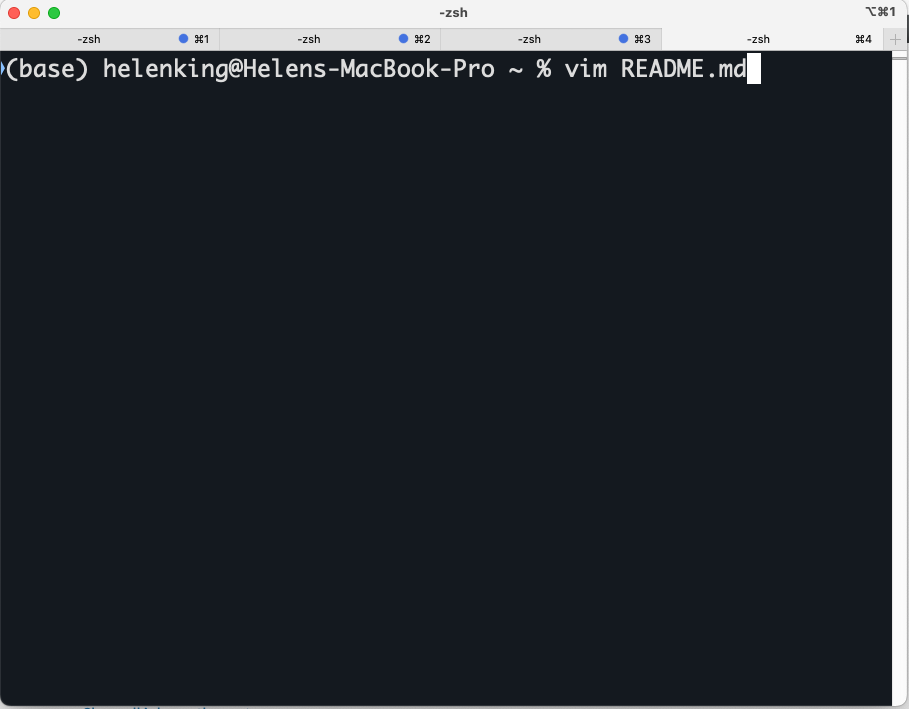
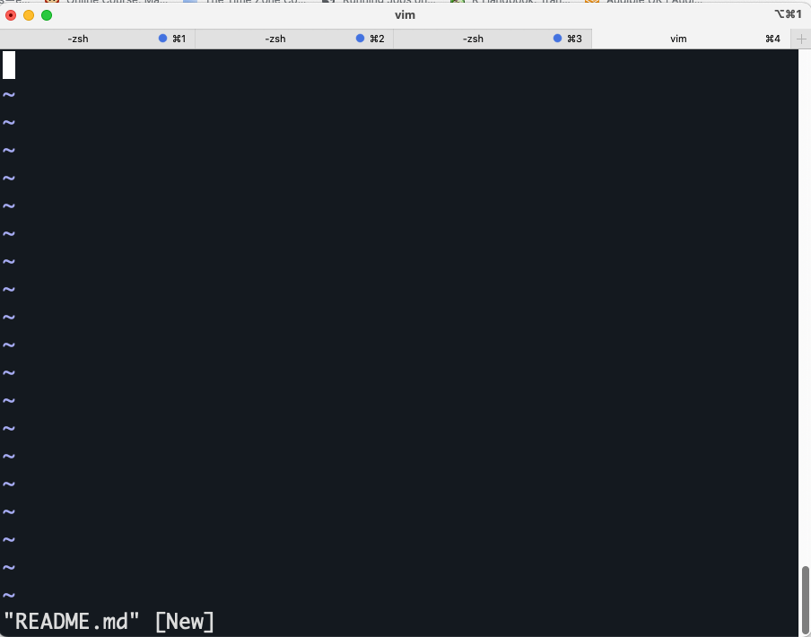

Writing Files with Vim
=============================================

> Overview
> --------
> 
> **Objectives**
> 
> *   Use the `vim` text editor to modify text files.
>     
> *   Write a basic shell script.
>

Writing files
-------------

We’ve been able to do a lot of work with files that already exist, but what if we want to write our own files? We’re not going to type in a FASTA file, but we’ll see as we go through other tutorials, there are a lot of reasons we’ll want to write a file, or edit an existing file.

To add text to files, we’re going to use a text editor called vim. We’re going to create a file to take notes about what we’ve been doing with the data files in `data`.

This is good practice when working in bioinformatics. We can create a file called `README.txt` that describes the data files in the directory or documents how the files in that directory were generated. As the name suggests, it’s a file that we or others should read to understand the information in that directory.

Let’s change our working directory to `data` using `cd`, then run `vim` to create a file called `README.txt`:

    $ cd data
    $ vim README.txt
    

You should see something like this:

The text at the bottom of the screen shows the keyboard shortcuts for performing various tasks in `vim`. We will talk more about how to interpret this information soon.

> Which Editor?
> -------------
> 
> When we say, “`vim` is a text editor. On Unix systems (such as Linux and Mac OS X), many programmers use [Emacs](https://www.gnu.org/software/emacs/) or [Vim](https://www.vim.org/) (both of which require more time to learn), or a graphical editor such as [Gedit](https://projects.gnome.org/gedit/). On Windows, you may wish to use [Notepad++](https://notepad-plus-plus.org/). Windows also has a built-in editor called `notepad` that can be run from the command line in the same way as `nano` for the purposes of this lesson.

Now you’ve written a file. You can take a look at it with `less` or `cat`, or open it up again and edit it with `vim`.

Creating and Closing a Vim File With and Without Saving
-------------------------------------------------------
To create a new file, you just have to use a new file name 

    $ vim README.txt

To prevent you editing unneccesarily you need to be able to navigate across modes. 
By default, you can move around with arrows keys or keystrokes. 

| Mode         | Description                                 | Navigate              |
| ------------ | ------------------------------------------- | --------------------- |
| Normal       | Default; for navigation and simple editing  | `Esc`                 |
| Insert       | For explicitly inserting and modifying text | `I`                   |
| Command Line | For operations like saving, exiting, etc.   |  `Control` and `[`    |

Whenever in any other mode navigate to normal mode press `Esc`. 
To navigate to Command navigate to normal mode press `Esc`. 
To navigate to command line mode, press `Control` and `[`.
This is how you can then quit without saving by entering `:q!`. Once you press enter you will have exited vim.

Saving modifications with Vim
------------------------------
Reopening the file and enter in a few words. 

    $ vim README.txt

First, hit `Esc` to check you are in normal mode. Press `i` to enter the Inset mode. In the lower-left hand side, you should see `--INSET--`.
Save the file by writing `:` followed by `wq`.

> Exercise
> --------
> 
> Open `README.txt` and add the date to the top of the file and save the file.

Navigation around a file
------------------------
By default, you can always use the arrows to move around a file. In a large file, it would be really hard to navigate. 
Switch to the Normal mode using the `Esc` key. Then type `:line_number` and hit `Enter`.

Let say we want to navigate to line 5.

      `:5`
      
To navigate till your last line you can type `:$`.

Searcing in a file
-------------------
Vim's search is really helpful. Go into the Command Line mode by (1) pressing Esc key, then (2) pressing colon : key.

We can search a keyword by entering `:/word_of_interest`, where `word_of_interest` is the text string you want to find. 

> Exercise
> --------
> 
> Open `README.txt` and search for the letter `h`.

Writing scripts
---------------

A really powerful thing about the command line is that you can write scripts. Scripts let you save commands to run them and also lets you put multiple commands together. Though writing scripts may require an additional time investment initially, this can save you time as you run them repeatedly. Scripts can also address the challenge of reproducibility: if you need to repeat an analysis, you retain a record of your command history within the script.

One thing we will commonly want to do with sequencing results is pull out bad reads and write them to a file to see if we can figure out what’s going on with them. We’re going to look for reads with long sequences of N’s like we did before, but now we’re going to write a script, so we can run it each time we get new sequences, rather than type the code in by hand each time.

We’re going to create a new file to put this command in. We’ll call it `bad-reads-script.sh`. The `sh` isn’t required, but using that extension tells us that it’s a shell script.

    $ vim bad-reads-script.sh
    

Bad reads have a lot of N’s, so we’re going to look for `NNNNNNNNNN` with `grep`. We want the whole FASTQ record, so we’re also going to get the one line above the sequence and the two lines below. We also want to look in all the files that end with `.fastq`, so we’re going to use the `*` wildcard.

    grep -B1 -A2 -h NNNNNNNNNN *.fastq | grep -v '^--' > scripted_bad_reads.txt
    

> Custom `grep` control
> ---------------------
> 
> We introduced the `-v` option previously, now we are using `-h` to “Suppress the prefixing of file names on output” according to the documentation shown by `man grep`.

Type your `grep` command into the file and save it as before. Be careful that you did not add the `$` at the beginning of the line.

Now comes the neat part. We can run this script. Type:

    $ bash bad-reads-script.sh
    

It will look like nothing happened, but now if you look at `scripted_bad_reads.txt`, you can see that there are now reads in the file.

> Exercise
> --------
> 
> We want the script to tell us when it’s done.
> 
> 1.  Open `bad-reads-script.sh` and add the line `echo "Script finished!"` after the `grep` command and save the file.
> 2.  Run the updated script.

Making the script into a program
--------------------------------

We had to type `bash` because we needed to tell the computer what program to use to run this script. Instead, we can turn this script into its own program. We need to tell the computer that this script is a program by making the script file executable. We can do this by changing the file permissions.

First, let’s look at the current permissions.

    $ ls -l bad-reads-script.sh
        

We see that it says `-rw-r--r--`. This shows that the file can be read by any user and written to by the file owner (you). We want to change these permissions so that the file can be executed as a program. We use the command `chmod` like we did earlier when we removed write permissions. Here we are adding (`+`) executable permissions (`+x`).

    $ chmod +x bad-reads-script.sh
    

Now let’s look at the permissions again.

    $ ls -l bad-reads-script.sh
   
    -rwxrwxr-x 1 helkin helkin 0 Oct 25 21:46 bad-reads-script.sh
    

Now we see that it says `-rwxr-xr-x`. The `x`’s that are there now tell us we can run it as a program. So, let’s try it! We’ll need to put `./` at the beginning so the computer knows to look here in this directory for the program.

    $ ./bad-reads-script.sh
    

The script should run the same way as before, but now we’ve created our very own computer program!

> Key Points
> ----------
> 
> *   Scripts are a collection of commands executed together.
> 
-----

Adapted from the Data Carpentry Intro to Command Line -shell genomics https://datacarpentry.org/shell-genomics/

Licensed under CC-BY 4.0 2018–2021 by The Carpentries  
Licensed under CC-BY 4.0 2016–2018 by [Data Carpentry](http://datacarpentry.org)
