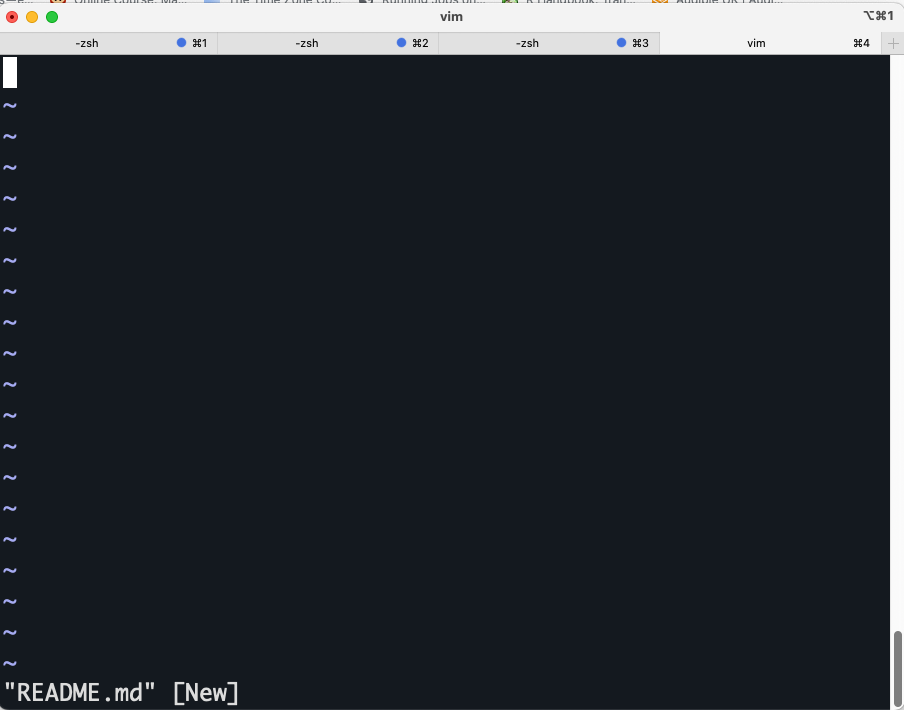

Writing Scripts and Submitting Jobs to the Wolfpack 
=============================================

> Overview
> --------
> 
> **Questions**
> 
> *   How can we automate a commonly used set of commands?
>
> *   How can we submit a job to the HPC?

> **Objectives**
> 
> *   Use the `vim` text editor to modify text files.
>     
> *   Write a basic shell script.
> 
>  *   Use `qsub` to run a job interactively.
>     
> *   Use the `bash` command to execute a shell script.
>     
> *   Use `chmod` to make a script an executable program.
> 

Writing files
-------------

We’ve been able to do a lot of work with files that already exist, but what if we want to write our own files? We’re not going to type in a FASTA file, but we’ll see as we go through other tutorials, there are a lot of reasons we’ll want to write a file, or edit an existing file.

To add text to files, we’re going to use a text editor called vim. We’re going to create a file to take notes about what we’ve been doing with the data files in `data`.

This is good practice when working in bioinformatics. We can create a file called `README.txt` that describes the data files in the directory or documents how the files in that directory were generated. As the name suggests, it’s a file that we or others should read to understand the information in that directory.

Let’s change our working directory to `data` using `cd`, then run `vim` to create a file called `README.txt`:

    $ cd data
    $ vim README.txt
    

You should see something like this:

The text at the bottom of the screen shows the keyboard shortcuts for performing various tasks in `vim`. We will talk more about how to interpret this information soon.

> Which Editor?
> -------------
> 
> When we say, “`vim` is a text editor. On Unix systems (such as Linux and Mac OS X), many programmers use [Emacs](https://www.gnu.org/software/emacs/) or [Vim](https://www.vim.org/) (both of which require more time to learn), or a graphical editor such as [Gedit](https://projects.gnome.org/gedit/). On Windows, you may wish to use [Notepad++](https://notepad-plus-plus.org/). Windows also has a built-in editor called `notepad` that can be run from the command line in the same way as `nano` for the purposes of this lesson.

Now you’ve written a file. You can take a look at it with `less` or `cat`, or open it up again and edit it with `vim`.

> Exercise
> --------
> 
> Open `README.txt` and add the date to the top of the file and save the file.
>

Wolfpack - How to start an interative job
-----------------------------------------
For a more in depth understanding of the Wolfpack please navigate through the intranet for more helpful infomation. Different clusters use use different tools to manage resources and schedule jobs. Wolfpack uses Sun Grid Engine (SGE) to control access to compute nodes. The implementation of SGE is custom so Googling may or may not provide useful answers. If you run the command below for infomation specific to Wolfpack-specific SGEL

    man qsub

We will not be going into a deep dive of high performance computers. In essence, compute nodes are just high performance computers. Made up of multiple fast CPUs (computational processing units), extra RAM (random access memory) and you can request whatever your analysis requires

The head node is not particularly powerful, and is shared by all logged-in users. Never run computational intense jobs there!!

The "polite" thing to do is to request an interactive node, or submit a job. For small jobs that you are troubleshooting, form an interactive session. An interactive job or interactive session is a session on a compute node with the required physical resources for the period of time requested. 

To request an interactive job, add the -I flag (capital i) to qsub. Default sessions will have 1 CPU core, 1GB and 1 hour

For example, the following two commands. The first provides a default session, the second provides a session with two CPU cores and 8GB memory. You can tell when an interactive job has started when you see the name of the node from dice01 to delta-3-2 to the name of the server your job is running on. 

    $ [helkin@dice02]$ qrsh

    $ [helkin@dice01]$ qrsh -l h_data=4G,h_vmem=8G -pe smp 2 
    $ [helkin@delta-3-2 ~]$

    
To see what is being run by you:

     $ qstat

Jobs are constrained by the resources that are requested. In the previous example the second job - running on delta-3-2 - would be terminated after 48 hours or if a command within the session consumed more than 8GB memory.

The job (and therefore the session) can also be terminated by running the command below.
  
     $ qdel

Writing scripts
---------------

A really powerful thing about the command line is that you can write scripts. Scripts let you save commands to run them and also lets you put multiple commands together. Though writing scripts may require an additional time investment initially, this can save you time as you run them repeatedly. Scripts can also address the challenge of reproducibility: if you need to repeat an analysis, you retain a record of your command history within the script.

One thing we will commonly want to do with sequencing results is pull out bad reads and write them to a file to see if we can figure out what’s going on with them. We’re going to look for reads with long sequences of N’s like we did before, but now we’re going to write a script, so we can run it each time we get new sequences, rather than type the code in by hand each time.

We’re going to create a new file to put this command in. We’ll call it `bad-reads-script.sh`. The `sh` isn’t required, but using that extension tells us that it’s a shell script.

    $ vim bad-reads-script.sh
    

Bad reads have a lot of N’s, so we’re going to look for `NNNNNNNNNN` with `grep`. We want the whole FASTQ record, so we’re also going to get the one line above the sequence and the two lines below. We also want to look in all the files that end with `.fastq`, so we’re going to use the `*` wildcard.

    grep -B1 -A2 -h NNNNNNNNNN *.fastq | grep -v '^--' > scripted_bad_reads.txt
    

> Custom `grep` control
> ---------------------
> 
> We introduced the `-v` option previously, now we are using `-h` to “Suppress the prefixing of file names on output” according to the documentation shown by `man grep`.

Type your `grep` command into the file and save it as before. Be careful that you did not add the `$` at the beginning of the line.

Now comes the neat part. We can run this script. Type:

    $ bash bad-reads-script.sh
    

It will look like nothing happened, but now if you look at `scripted_bad_reads.txt`, you can see that there are now reads in the file.

> Exercise
> --------
> 
> We want the script to tell us when it’s done.
> 
> 1.  Open `bad-reads-script.sh` and add the line `echo "Script finished!"` after the `grep` command and save the file.
> 2.  Run the updated script.
> 

Making the script into a program
--------------------------------

We had to type `bash` because we needed to tell the computer what program to use to run this script. Instead, we can turn this script into its own program. We need to tell the computer that this script is a program by making the script file executable. We can do this by changing the file permissions.

First, let’s look at the current permissions.

    $ ls -l bad-reads-script.sh
        

We see that it says `-rw-r--r--`. This shows that the file can be read by any user and written to by the file owner (you). We want to change these permissions so that the file can be executed as a program. We use the command `chmod` like we did earlier when we removed write permissions. Here we are adding (`+`) executable permissions (`+x`).

    $ chmod +x bad-reads-script.sh
    

Now let’s look at the permissions again.

    $ ls -l bad-reads-script.sh
   
    -rwxrwxr-x 1 helkin helkin 0 Oct 25 21:46 bad-reads-script.sh
    

Now we see that it says `-rwxr-xr-x`. The `x`’s that are there now tell us we can run it as a program. So, let’s try it! We’ll need to put `./` at the beginning so the computer knows to look here in this directory for the program.

    $ ./bad-reads-script.sh
    

The script should run the same way as before, but now we’ve created our very own computer program!

Wolfpack - How to start an batch job
-------------------------------------------
A batch job is a script that runs autonomously on a compute node. The script must contain the necessary sequence of commands to complete a task independently of any input from the user. This section contains information about how to create and submit a batch job on Wolfpack.

You must now edit your bad-reads-script.sh to have the same format as below.

    #!/bin/bash
    grep -B1 -A2 -h NNNNNNNNNN *.fastq | grep -v '^--' 

This script can be now be submitted to the cluster with qsub and it will become a job and be assigned to a queue. 

    $ qsub /[location]/bad-reads-script.sh

As with interactive jobs, the -l (lowercase L) flag can be used to specify resource requirements for the job:

    $ qsub -cwd -M hking@garvan.org.au -b y -q long.q -N name_of_job -pe smp 4 -l mem_requested=4.5G,tmp_requested=13.5G /[location]/bad-reads-script.sh

Memory is what your computer uses to store data temporarily. This is called RAM (random acesss memory) is hardware allows the computer to efficiently perform more than one task at a time. Disk space refers to hard drive storage while storage is where you save files permanently.

The total memory is the number of cores (`smp`) times by the value of `mem_requested` requested. Nodes have ~8G per core, up to ~1TB total. Your job will be killed if it uses too much RAM, but there is no error message or way to tell this is the case. 

Total Disk Space is the number of cores (`smp`) times the value of `tmp_requested`. Nodes have up to 250G per core, up to 20TB total. Older nodes have much less.

For more infomation on the different settings to use:
https://intranet.gimr.garvan.org.au/pages/viewpage.action?pageId=74712562

You can also rewrite your original script to include the job requests within the script like below:

    #$ -S /bin/sh
    #$ -q short.q
    #$ -pe smp 2
    #$ -j y
    #$ -b y

    . ~/.bash_profile
    export PATH="/share/ClusterShare/biodata/contrib/helkin/anaconda3/bin:$PATH"
    module load fastqc

### Extension task
Check the memory for each node.

    qstat -F | grep 'mem\|local'

Check the core and RAM usage (all somewhat unreliable) using EG:
    
    /usr/bin/time -v echo test program
    #       (user time + sys time) / real time
    qacct/qstat -j 12345
    
    
 Check the diskspace 
    
    du -sh "$TMPDIR"
    
    
Transferring Data Between your Local Machine and Wolfpack (there and back again)
----------------------------------------------------------------------

### Uploading Data to your Virtual Machine with scp

`scp` stands for ‘secure copy protocol’, and is a widely used UNIX tool for moving files between computers. The simplest way to use `scp` is to run it in your local terminal, and use it to copy a single file:

    scp <file I want to move> <where I want to move it>
    

Note that you are always running `scp` locally, but that _doesn’t_ mean that you can only move files from your local computer. In order to move a file from your local computer to an AWS instance, the command would look like this:

    $ scp <local file> <wolfpack login details>:"location"
    
e.g ***On my Mac computer**** scp README.md username@dice01.garvan.unsw.edu.au:"somewhere/nice/"
    
To move it back to your local computer, you re-order the `to` and `from` fields:

    $ scp <wolfpack login details> <local file>:"location"
    
e.g ***On my Mac computer**** scp username@dice01.garvan.unsw.edu.au:"somewhere/nice/README.md" /somewhere/okay/

**Tip:** If you are looking for another (or any really) text file in your home directory to use instead, try:

    $ find ~ -name *.txt
    

> Key Points
> ----------
> 
> *   Scripts are a collection of commands executed together.
> 
> *    How to submit interactive jobs
>     
> *   Transferring information to and from virtual and local computers.
>     
-----

Adapted from the Data Carpentry Intro to Command Line -shell genomics https://datacarpentry.org/shell-genomics/

Licensed under CC-BY 4.0 2018–2021 by The Carpentries  
Licensed under CC-BY 4.0 2016–2018 by [Data Carpentry](http://datacarpentry.org)
