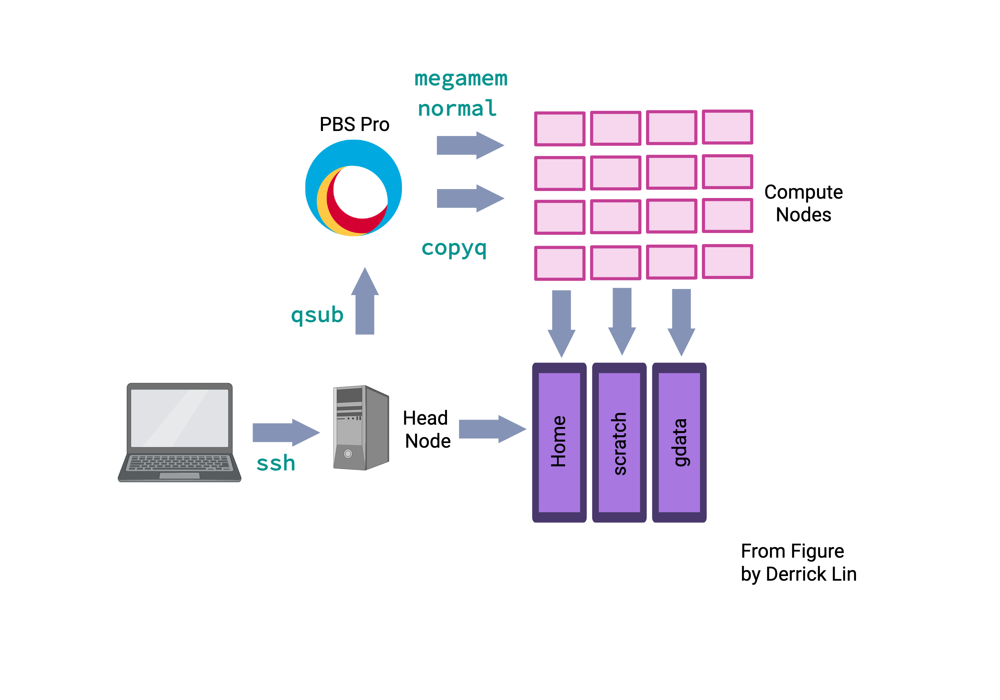

Submitting Jobs to the NCI GADI 
================================

> Overview
> --------
> 
> **Questions**
> 
> *   How can we automate a commonly used set of commands?
>
> *   How can we submit a job to the HPC?

> **Objectives**
> 
>  *   Use `qsub -I` to run a job interactively.
>  
>  *   Use `qsub` to submit a batch job
>     
> *   Use the `bash` command to execute a shell script.
>     
> *   Use `chmod` to make a script an executable program.
> 

NCI GADI - How to start an interactive job
-----------------------------------------
For a more in-depth understanding of the NCI GADI, you can go through the intranet for more helpful information. Different clusters use different tools to manage resources and schedule jobs. NCI GADI uses OpenPBS to control access to compute nodes. The implementation of OpenPBS is custom so Googling may or may not provide useful answers. 

    man qsub

We will not go into a deep dive on high-performance computing. In essence, compute nodes are just high-performance computers. Made up of multiple fast CPUs (computational processing units), extra RAM (random access memory), and you can request whatever your analysis requires.

The login node is not particularly powerful and is shared by all logged-in users. Never run computationally intensive jobs there!!

The "polite" thing to do is to request an interactive node or submit a job. For debugging code before "submitting a job", form an interactive session. An interactive job is a session on a compute node with the required physical resources for the period requested.  There are different nodes with different hardware, e.g. different types of CPUs, amount of memory and GPUs. 

To request an interactive job, use the function `qsub -I`. Default sessions will have 512 MB RAM and ncpu=1. However, specify the directory where temporary files are stored below (`storage`).

For example,consider the following two commands. The first provides a default session, the second provides a session of 100GB of RAM shared across 12 CPUs and 50GB of temporary local disk storage used for intermediate files. You can tell when an interactive job has started when you see the node's name, from gadi-login-09 to gadi-cpu-clx-1547, and the name of the server your job is running on. 

    [hk1145@gadi-login-09 hk1145]$ qsub -I -q normal -P im21 -l walltime=00:05:00,ncpus=12,ngpus=0,mem=100GB,jobfs=50GB,storage=gdata/im21
    qsub: waiting for job 140645703.gadi-pbs to start
    qsub: job 140645703.gadi-pbs ready
    [hk1145@gadi-cpu-clx-1547 ~]$

    
To see what is being run by you:

     $ qstat

Jobs are constrained by the resources that are requested. In the previous example, it is terminated after 5 minutes or if a command within the session consumes more than 100GB of memory. 

The job (and the session) can also be terminated by running the command below.
  
     $ qdel 

NCI GADI - How to start a batch job
-------------------------------------------
A batch job is a script that runs autonomously on a compute node. The script must contain the necessary sequence of commands to complete a task independently of any input from the user. This section contains information about how to create and submit a batch job on GADI.

You must now edit your `bad-reads-script.sh` to have the same format as below.

    #!/bin/bash
    grep -B1 -A2 -h NNNNNNNNNN *.fastq | grep -v '^--' 

This script can now be submitted to the cluster with qsub, and it will become a job and be assigned to a queue. 

    $ ls /scratch/im21/[your_userid]/data/bad-reads-script.sh

As with interactive jobs, the -l (lowercase L) flag can be used to specify resource requirements for the job:

    $ qsub -l ncpus=1,mem=2GB,jobfs=2GB,walltime=02:00:00,storage=gdata/im21+massdata/im21,wd -q normal -lother=mdss -P im21 /scratch/im21/[your_userid]/data/bad-reads-script.sh

Memory is what your computer uses to store data temporarily. This is called RAM (random access memory), which is hardware that allows the computer to efficiently perform more than one task at a time. Disk space refers to hard drive storage, while storage is where you save files permanently.

The total memory, `mem`, is shared across the number of cores (`ncpus`). Depending on the queue, different hardware can have varying amounts of RAM ~8G per core, up to ~1TB. Your job will be killed if it uses too much RAM, but there is no error message or way to tell that this is the case.  

Please change to the `copyq` node if you run a job requiring internet access, long software installation and access to massdata.

You can also rewrite your original script to include the job requests within the script, like below:

    #!/bin/bash
    
    #PBS -l ncpus=1
    #PBS -l mem=2GB
    #PBS -l jobfs=2GB
    #PBS -q copyq
    #PBS -lother=im21
    #PBS -P im21
    #PBS -l walltime=02:00:00
    #PBS -l storage=gdata/im21+massdata/im21
    #PBS -l wd
    
    
    echo "check my script"
    cd /scratch/im21/[your_userid]/data/
    grep -B1 -A2 NNNNNNNNNN SRR2589044_1.fastq

### Extension task

Can you (a) check what the two output files are, (b) what they contain using `head` or `cat` and (c) what is the difference between them?
    
    
Transferring Data Between your Local Machine and NCI GADI (there and back again)
----------------------------------------------------------------------

### Uploading Data to your Virtual Machine with scp

`scp` stands for ‘secure copy protocol’, and is a widely used UNIX tool for moving files between computers. The simplest way to use `scp` is to run it in your local terminal and use it to copy a single file:

    scp <file I want to move> <where I want to move it>
    

Note that you are always running `scp` locally, but that _doesn’t_ mean that you can only move files from your local computer. To move a file from your local computer to an HPC, the command would look like this:

    $ scp <local file> <NCI GADI login details>:"location"
    
e.g *** On my Mac computer**** `scp README.md [your_userID]@gadi.nci.org.au:"somewhere/nice/"`

    
To move it back to your local computer, you reorder the `to` and `from` fields:

    $ scp <NCI GADI login details> <local file>:"location"

*** On my Mac computer *** `scp [your_userID]@gadi.nci.org.au:"somewhere/nice/README.md"` /somewhere/okay/

### Extension task

1. Can you try to transfer your script to your local computer? First, you have to log out of NCI GADI.

        $ scp [your_userID]@gadi.nci.org.au:"/scratch/im21/[your_userid]/data/bad-reads-script.sh" .

2. Check where the file might be by searching your local computer.

3. Try changing the command from `scp` to `rsync`. What is the difference?

Vocabulary
-----------
The role of the OpenPBS scheduler is to match available resources to jobs.
In different contexts, the terms can have varying meanings. However, if we focus on the context of HPC, here are the definitions:
> A *cluster* consists of multiple compute nodes.
> A *node* refers to a unit within a computer cluster, typically a computer. It usually has one or two CPUs, each with multiple cores. The cores on the same CPU share memory, but memory is generally not shared between CPUs.
> A *CPU (computational processing unit)* is a resource provided by a node. In this context, it can refer to a core or a hardware thread based on the SGE configuration.
> A core is the part of a processor responsible for computations. A processor can have multiple cores.
> A login node is the destination for SSH access. In the case of the NCI GADI, there are two login nodes: dice01 and dice02.
> A compute node provides resources like processors, random access memory (RAM), and disk space.
> In the context of SGE, a processor is called a socket, the physical slot on the motherboard hosting the processor. A single core can have one or two hardware threads. Hardware multi-threading allows the operating system to perceive twice the number of cores while only doubling certain core components, typically related to memory and I/O rather than computation. Hardware multi-threading is often disabled in HPC (high-performance computing) environments.
> A *job* consists of one or more sequential steps, and each step can have one or more parallel tasks. A task represents an instance of a running program, which may include subprocesses or software threads.
> Multiple tasks are dispatched to potentially multiple nodes, depending on their core requirements. The number of cores a task needs depends on the number of subprocesses or software threads within the running program instance. The goal is to assign each hardware thread to a core and ensure all cores assigned to a task are on the same node.
> When a job is submitted to the SGE scheduler, it initially waits in the queue before being executed on the compute nodes. The duration spent in the queue is referred to as the queue time, while the time it takes for the job to run on the compute nodes is called the execution time.

> Key Points
> ----------
> 
> *   Scripts are a collection of commands executed together.
> 
> *    How to submit interactive jobs
>     
> *   Transferring information to and from virtual and local computers.
>     
-----

Adapted from the Data Carpentry Intro to Command Line -shell genomics https://datacarpentry.org/shell-genomics/

Licensed under CC-BY 4.0 2018–2021 by The Carpentries  
Licensed under CC-BY 4.0 2016–2018 by [Data Carpentry](http://datacarpentry.org)
