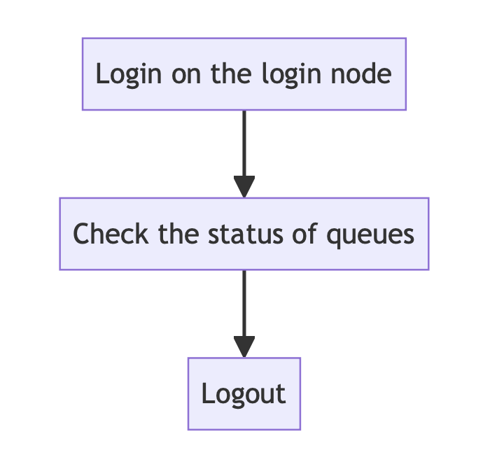
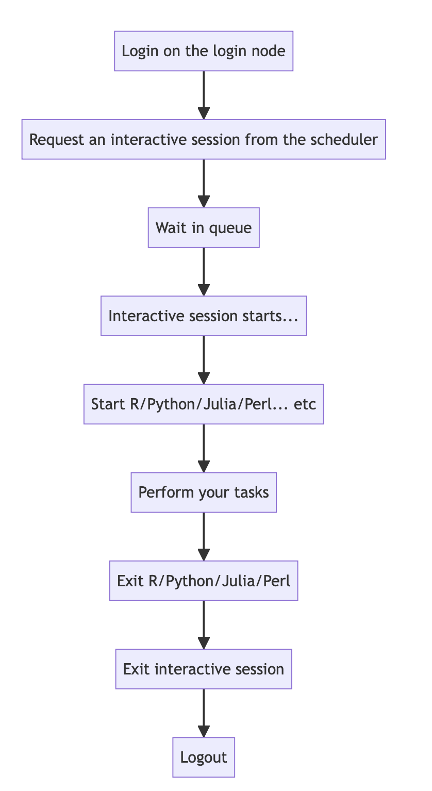

Submitting Jobs to the NCI Gadi 
================================

> Overview
> --------
> 
> **Objectives**
> 
> Understand the difference between:
>    
>  * Available commands
> 
>  * Limits on time, storage space and other resources
>
> * Environment and site policies
>   
    

This is an additional guide useful for familiarising yourself with other HPCs, but please attend the in-person courses for both Gadi and Katana to maximise your (and their) computational potential. This includes Intro to HPC—Gadi, put on by the Data Science Pillar (DSP), and the Katana-specific course.

Different Scheduler Commands Across Different HPCs  
---------------------

As we did in the previous session, when submitting a script, there are slightly different commands **and** flags to customise the submission. 

An example includes requesting an interactive login session. In NCI GADi is `qsub -I ` and UNSW Katana is `qsub -I`.

| Link | Details |
| ---- | ---- |
| [NCI Gadi Submission](https://opus.nci.org.au/display/Help/0.+Welcome+to+Gadi#id-0.WelcometoGadi-GadiJobs) | For Gadi HPC at NCI in Canberra |
| [UNSW Katana](https://docs.restech.unsw.edu.au/using_katana/running_jobs/) | For Katana HPC at UNSW |

Workflows for Beginners
----------------------------
Simon Thing-Yew Yin has collated an expansive list of workflows, all of which are everyday ways to interact with your HPC of interest.  

1) Find out the queues and their status
   
2) Find out the site limits
   
3) Working interactively
   
4) Requesting more RAM
   
5) Requesting more RAM and **more** time
   
6) Requesting more RAM, more time, and **more CPU cores**
   
7) Using a project code

## 1: Find out the queues and their status

| Category | Link | Details |
| ---- | ---- | ---- |
| | [NCI](https://opus.nci.org.au/pages/viewpage.action?pageId=236881198) | For Gadi HPC at NCI in Canberra, login and then run: `qstat -Q` |
| | [UNSW](https://docs.restech.unsw.edu.au/using_katana/running_jobs/#get-information-about-the-state-of-the-scheduler) | For Katana HPC at UNSW, login and then run: `pstat` |

## 2: Find out the Site Limits
**Note:** Site limits vary depending on the queue you select!

| Category | Link | Details |
| ---- | ---- | ---- |
| | [NCI](https://opus.nci.org.au/pages/viewpage.action?pageId=236881198) | For Gadi HPC at NCI in Canberra |
| | [UNSW](https://docs.restech.unsw.edu.au/using_katana/running_jobs/#job-queue-limits-summary) | For Katana HPC at UNSW |

**Exceptions to Site Limits**

It's a good idea to **contact the support team at the specific site** if you have a **well justified** reason to apply for an exception to any of the published site limits:

| Category | Site | Details |
| ---- | ---- | ---- |
| | NCI| help@nci.org.au |
| | UNSW | restech.support@unsw.edu.au |

## 3: Begin Working Interactively
**Important Note:** You must request an `interactive job` whenever you work interactively.  

**Unless you request an interactive job (or submit a job to a queue), you should avoid heavy computation and data transfer activities!**

| Category | Link | Details |
| ---- | ---- | ---- |
| | [NCI](../assets/img/nci_gadi_request_interactive.pdf) | For Gadi HPC at NCI in Canberra |
| | [UNSW](https://docs.restech.unsw.edu.au/using_katana/running_jobs/#interactive-jobs) | For Katana HPC at UNSW |

## 4: Requesting more RAM
To request 16GB RAM, modify Section 3 with:

| Category | Site | Details |
| ---- | ---- | ---- |
| | NCI| `qsub -I -l mem=16gb` |
| | UNSW | `qsub -I -l select=1:mem=16gb` |

## 5: Requesting more RAM + more time
To request 1 hour 30 minutes:

| Category | Site | Details |
| ---- | ---- | ---- |
| Request more RAM + more time | NCI| `qsub -I -l mem=16gb,walltime=01:30:00` |
| | UNSW | `qsub -I -l select=1:mem=16gb,walltime=01:30:00` |

## 6: Requesting more RAM + more time + more cpu-cores
To request 4 cpu-cores:

| Category | Site | Details |
| ---- | ---- | ---- |
| Request more RAM + more time + more cpu-cores  | NCI| `qsub -I -l mem=16gb,ncpus=4,walltime=01:30:00` |
| | UNSW | `qsub -I -l select=1:mem=16gb,ncpus=4,walltime=01:30:00` |

## 7: Using a Project Code
When you sign up for each HPC, you will usually be allocated a project based on your lab.
Replace `<my_UNSW_project>` and `<my_NCI_project>` as appropriate for your case.

| Category | Site | Details |
| ---- | ---- | ---- |
| Use a project code | NCI|  `qsub -I -P <my_NCI_project> -l mem=16gb,ncpus=4,walltime=01:30:00` **Note:** Use: `nci_account` to see your NCI project code. |
| | UNSW |  `qsub -I -P <my_UNSW_project> -l select=1:mem=16gb,ncpus=4,walltime=01:30:00` |

-----

Written by [Simon Thing-Yew Yin](https://www.linkedin.com/in/simon-yin-76b420/) - Linux Administrator for DSP

Edited by HK 
