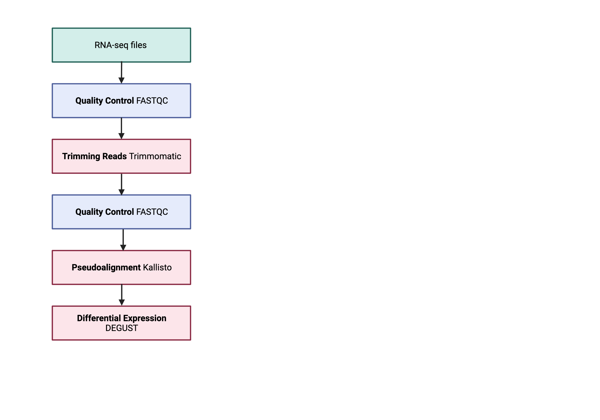
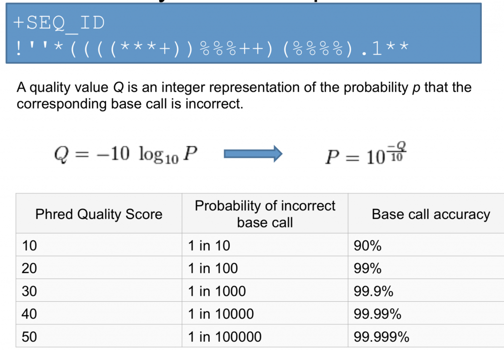

Running FASTQC to Assess Read Quality
======================

> Overview
> --------
> 
> 
> **Questions**
> 
> *   How can I describe the quality of my data?
>     
> 
> **Objectives**
> 
> *   Explain how a FASTQ file encodes per-base quality scores.
>     
> *   Interpret a FastQC plot summarizing per-base quality across all reads.
>     
> *   Use `for` loops to automate operations on multiple files.
> 
> *   How to download data from the HPC

Bioinformatic workflows
=======================

When working with high-throughput sequencing data, the raw reads you get off of the sequencer will need to pass through a number of different tools in order to generate your final desired output. The execution of this set of tools in a specified order is commonly referred to as a _workflow_ or a _pipeline_.

An example of the RNA workflow is provided below.

1.  Quality control - Assessing quality using FastQC
2.  Quality control - Trimming and/or filtering reads (if necessary)
3.  Align reads to reference genome
4.  Differential expression DESeq2 

Standard data formats are essential and used throughout bioinformatics. We will be only performing quality control to check the quality of FastQC.

Starting with data
==================

**Recap** 
## What is the difference between single and paired end reads?
With paired-end sequencing, both ends of the fragment are sequenced. With single-end sequencing, only one end is of a fragment is sequenced. If the data is paired-end, you have two files for each sample.

To download the data, please:

1) request an interactive session using qsub 

2) Use `mkdir` to create a folder for your input fasta file e.g. **data**
You can use the `-p` option for `mkdir`. This option allows `mkdir` to create the new directory, even if one of the parent directories does not already exist. It also supresses errors if the directory already exists, without overwriting that directory.

3) Download the dataset below to your local scratch 

    $   mkdir -p [yourscratch]/data/
    $   cd data

    $   wget ftp://ftp.sra.ebi.ac.uk/vol1/fastq/SRR258/004/SRR2589044/SRR2589044_1.fastq.gz
    $   wget ftp://ftp.sra.ebi.ac.uk/vol1/fastq/SRR258/004/SRR2589044/SRR2589044_2.fastq.gz

The data comes in a compressed format, which is why there is a `.gz` at the end of the file names. This makes it faster to transfer, and allows it to take up less space on our computer. To unzip one of the files - you can look at the fastq format.

    $ gunzip SRR2584863_1.fastq.gz #do not do this!!!
    

Quality control
===============

We will now assess the quality of the sequence reads contained in our fastq files.

We can view the first complete read in one of the files our dataset by using `head` to look at the first four lines.

    $ zcat SRR306844chr1_chr3.fastq.gz | head -n 4
    

Line 4 shows the quality for each nucleotide in the read. Quality is interpreted as the probability of an incorrect base call (e.g. 1 in 10) or, equivalently, the base call accuracy (e.g. 90%). To make it possible to line up each individual nucleotide with its quality score, the numerical score is converted into a code where each individual character represents the numerical quality score for an individual nucleotide. For example, in the line above, the quality score line is:

    !69699><;;:8=+:::::987765979858859775775883796699+48789599878592274362843111    

The numerical value assigned to each of these characters depends on the sequencing platform that generated the reads. The sequencing machine used to generate our data uses the standard Sanger quality PHRED score encoding, using Illumina version 1.8 onwards. Each character is assigned a quality score between 0 and 41 as shown in the chart below.

    Quality encoding: !"#$%&'()*+,-./0123456789:;<=>@ABCDEFGHI
                       |        |         |        |       |
    Quality score:   01........11........20........30.......40
    

Each quality score represents the probability that the corresponding nucleotide call is incorrect. This quality score is logarithmically based, so a quality score of 10 reflects a base call accuracy of 90%, but a quality score of 20 reflects a base call accuracy of 99%. These probability values are the results from the base calling algorithm and depend on how much signal was captured for the base incorporation.

Looking back at our read:

    @SRR306844.16.1
    NTGTAAATGAGTGAGGCAGGAGTCCGAGGAGGTTAGTTGTGGCAATAAAAATGATTAAGGATACTAGTATAAGAGA
    +
    !69699><;;:8=+:::::987765979858859775775883796699+48789599878592274362843111

we can now see that there is a range of quality scores, but that the end of the sequence is very poor (`!` = a quality score of 1).

> Exercise
> --------
> 
> What is the last read in your file? Is this read of high quality, explain?
> Hint use command: tail
> 

Loading a new function
------------------------

Try and run fastqc to see if it is available, if not we will "load" into your local path. 
   
    $ fastqc

You will not be asked to install any packages in this course. The functions will be available through a main installation but you will need to modify your local environment so your computer knows exactly where the main installation is. 

    $ module avail 
    
    
To find modules of interest, you can use the `grep` command to filter out a string. E.g. any package with "t"

    $ module avail 2>&1 | grep t
    
  
If you are interested in installing user defined packages John Reeves has done an informatic recording with how to use anaconda (an installation manager). https://intranet.gimr.garvan.org.au/display/BINF/Session+2+-+Conda+environments+and+the+Wolfpack+migration

    
> Exercise
> ------------
> Which function would you use to filter the output of module avail to show only output with keyword **"fastq"** ?
> 
   
    
    
To load the function. You need 

    $ module load centos7.8/elypar/fastqc/0.11.5 
    

Please run the command below to output the command line options.

    $ fastqc -h
                FastQC - A high throughput sequence QC analysis tool
    
    SYNOPSIS
    
            fastqc seqfile1 seqfile2 .. seqfileN
    
        fastqc [-o output dir] [--(no)extract] [-f fastq|bam|sam]
               [-c contaminant file] seqfile1 .. seqfileN
    
    DESCRIPTION
    
        FastQC reads a set of sequence files and produces from each one a quality
        control report consisting of a number of different modules, each one of
        which will help to identify a different potential type of problem in your
        data.
    
        If no files to process are specified on the command line then the program
        will start as an interactive graphical application.  If files are provided
        on the command line then the program will run with no user interaction
        required.  In this mode it is suitable for inclusion into a standardised
        analysis pipeline.
    
        The options for the program as as follows:
    
        -h --help       Print this help file and exit
    
        -v --version    Print the version of the program and exit
    
        -o --outdir     Create all output files in the specified output directory.
                        Please note that this directory must exist as the program
                        will not create it.  If this option is not set then the
                        output file for each sequence file is created in the same
                        directory as the sequence file which was processed.
    
        --casava        Files come from raw casava output. Files in the same sample
                        group (differing only by the group number) will be analysed
                        as a set rather than individually. Sequences with the filter
                        flag set in the header will be excluded from the analysis.
                        Files must have the same names given to them by casava
                        (including being gzipped and ending with .gz) otherwise they
                        will not be grouped together correctly.
    
        --nano          Files come from naopore sequences and are in fast5 format. In
                        this mode you can pass in directories to process and the program
                        will take in all fast5 files within those directories and produce
                        a single output file from the sequences found in all files.
    
        --nofilter      If running with --casava then don't remove read flagged by
                        casava as poor quality when performing the QC analysis.
    
        --extract       If set then the zipped output file will be uncompressed in
                        the same directory after it has been created.  By default
                        this option will be set if fastqc is run in non-interactive
                        mode.
    
        -j --java       Provides the full path to the java binary you want to use to
                        launch fastqc. If not supplied then java is assumed to be in
                        your path.
    
        --noextract     Do not uncompress the output file after creating it.  You
                        should set this option if you do not wish to uncompress
                        the output when running in non-interactive mode.
    
        --nogroup       Disable grouping of bases for reads >50bp. All reports will
                        show data for every base in the read.  WARNING: Using this
                        option will cause fastqc to crash and burn if you use it on
                        really long reads, and your plots may end up a ridiculous size.
                        You have been warned!
    
        -f --format     Bypasses the normal sequence file format detection and
                        forces the program to use the specified format.  Valid
                        formats are bam,sam,bam_mapped,sam_mapped and fastq
    
        -t --threads    Specifies the number of files which can be processed
                        simultaneously.  Each thread will be allocated 250MB of
                        memory so you shouldn't run more threads than your
                        available memory will cope with, and not more than
                        6 threads on a 32 bit machine
    
        -c              Specifies a non-default file which contains the list of
        --contaminants  contaminants to screen overrepresented sequences against.
                        The file must contain sets of named contaminants in the
                        form name[tab]sequence.  Lines prefixed with a hash will
                        be ignored.
    
        -a              Specifies a non-default file which contains the list of
        --adapters      adapter sequences which will be explicity searched against
                        the library. The file must contain sets of named adapters
                        in the form name[tab]sequence.  Lines prefixed with a hash
                        will be ignored.
    
        -l              Specifies a non-default file which contains a set of criteria
        --limits        which will be used to determine the warn/error limits for the
                        various modules.  This file can also be used to selectively
                        remove some modules from the output all together.  The format
                        needs to mirror the default limits.txt file found in the
                        Configuration folder.
    
       -k --kmers       Specifies the length of Kmer to look for in the Kmer content
                        module. Specified Kmer length must be between 2 and 10. Default
                        length is 7 if not specified.
    
       -q --quiet       Supress all progress messages on stdout and only report errors.
    
       -d --dir         Selects a directory to be used for temporary files written when
                        generating report images. Defaults to system temp directory if
                        not specified.
    
    BUGS
    
        Any bugs in fastqc should be reported either to [email protected]
        or in www.bioinformatics.babraham.ac.uk/bugzilla/
    

Assessing quality using FastQC
------------------------------

In real life, you will not be assessing the quality of your reads by visually inspecting your FASTQ files. Rather, you will be using a software program to assess read quality and filter out poor quality reads. We will first use a program called [FastQC](http://www.bioinformatics.babraham.ac.uk/projects/fastqc/) to visualize the quality of our reads. Later in our workflow, we will use another program to filter out poor quality reads.

FastQC has a number of features that can give insight into any problems your data may have. This can sto you from carrying issues forward in your analyses. Rather than looking at quality scores for each individual read, FastQC looks at quality collectively across all reads within a sample. The image below shows one FastQC-generated plot that indicates a very high quality sample:

The x-axis displays the base position in the read, and the y-axis shows quality scores. In this example, the sample contains reads that are 40 bp long. This is much shorter than the reads we are working with in our workflow. For each position, there is a box-and-whisker plot showing the distribution of quality scores for all reads at that position. The horizontal red line indicates the median quality score and the yellow box shows the 1st to 3rd quartile range. This means that 50% of reads have a quality score that falls within the range of the yellow box at that position. The whiskers show the absolute range, which covers the lowest (0th quartile) to highest (4th quartile) values.

For each position in this sample, the quality values do not drop much lower than 32. This is a high quality score. The plot background is also color-coded to identify good (green), acceptable (yellow), and bad (red) quality scores.

Now let’s take a look at a quality plot on the other end of the spectrum.

Here, we see positions within the read in which the boxes span a much wider range. Also, quality scores drop quite low into the “bad” range, particularly on the tail end of the reads. The FastQC tool produces several other diagnostic plots to assess sample quality, in addition to the one plotted above.

Running FastQC
--------------

We will now assess the quality of the reads that we downloaded. First, make sure you are still in the `data` directory

    $ cd /[yourscratch]/data/
    

> Exercise
> --------
> 
> How big are your files? (Hint: Look at the options for the `ls` command to see how to show file sizes.)
> 

FastQC can accept multiple file names as input, and on both zipped and unzipped files, so we can use the \*.fastq\* wildcard to run FastQC on all of the FASTQ files in this directory.

    $ fastqc *.fastq*
    

You will see an automatically updating output message telling you the progress of the analysis. It will start like this:

    Started analysis of SRR2589044_1.fastq.gz
    Approx 5% complete for SRR2589044_1.fastq.gz
    Approx 10% complete for SRR2589044_1.fastq.gz
    Approx 15% complete for SRR2589044_1.fastq.gz

The FastQC program has created several new files within our `/data/` directory.

    $ ls
    

For each input FASTQ file, FastQC has created a `.zip` file and a

`.html` file. The `.zip` file extension indicates that this is actually a compressed set of multiple output files. We will be working with these output files soon. The `.html` file is a stable webpage displaying the summary report for each of our samples.

We want to keep our data files and our results files separate, so we will move these output files into a new directory within our `results/` directory.

    $ mkdir -p [yourscratch]/fastqc_data/
    $ mv *.zip [yourscratch]/fastqc_data/
    $ mv *.html [yourscratch]/fastqc_data/
    

Now we can navigate into this results directory and do some closer inspection of our output files.

    $ cd [yourscratch]/fastqc_data/
    

Viewing the FastQC results
--------------------------

If we were working on our local computers, we would be able to look at each of these HTML files by opening them in a web browser. However, to look at a summary version of the Fastqc html files- we need to create a summary file.

These files are currently sitting on Wolfpack, where our local computer cannot see them. And, since we are only logging into the Wolfpack via the command line - it does not have any web browser setup to display these files either.

So the easiest way to look at these webpage summary reports will be to transfer them to our local computers (i.e. your laptop).

To transfer a file from a remote server to our own machines, we will use `scp`.

First we will make a new directory on our computer to store the HTML files we are transferring. Let’s put it on our desktop for now. Open a new tab in your terminal program (you can use the pull down menu at the top of your screen or the Cmd+t keyboard shortcut) and type:

    $ mkdir -p ~/Desktop/FASTQC_HTML
    

Now we can transfer our HTML files to our local computer.

1) Check if you have a Mac/Linux operating system or Windows operating system.
2) Open a new terminal/putty window where you are NOT logged into Wolfpack.

**For a Mac/Linux OS:**

3) Navigate into a known location e.g. Desktop with the `cd` command.

**For a Windows OS:**
 

3) Navigate into a known location with the equivalent command as `cd` which is `pushd` or `popd`

  
4) Using `scp` to move some information from scratch to your local computer.

    $ scp [userID]@dice01.garvan.unsw.edu.au:"[your_scratch_directory]/data_fastqc/*.html" .
    
    
 Understanding the Phred Quality Score
-----------------------------------------

How the phred quality score actually makes sense in terms of accuracy:

> Note on using zsh
> -----------------
> 
> If you are using zsh instead of bash (macOS for example changed the default recently to zsh), it is likely that a `no matches found` error will be displayed. The reason for this is that the wildcard (“\*”) is not correctly interpreted. To fix this problem the wildcard needs to be escaped with a “\\”:
    
Now we can go to our new directory and open the 6 HTML files.

Depending on your system, you should be able to select and open them all at once via a right click menu in your file browser.

> Exercise
> --------
> 
> Discuss your results with your group or a neighbor. Which sample(s) looks the best in terms of per base sequence quality? Which sample(s) look the worst?
> 

Working with the FastQC text output
-----------------------------------

Our `.zip` files are compressed files. They each contain multiple different types of output files for a single input FASTQ file. To view the contents of a `.zip` file, we can use the program `unzip` to decompress these files. Let’s try doing them all at once using a wildcard.

To unzip the files 

    $ unzip *.zip

    $ for filename in *.zip
    > do
    > unzip $filename
    > done
    
Let’s see what files are present within one of these output directories.
   
Use `less` to preview the `summary.txt` file for this sample.

    $ cat SRR2584863_FASTQC/summary.txt
    
The summary file gives us a list of tests that FastQC ran, and tells us whether this sample passed, failed, or is borderline (`WARN`). Remember, to quit from `less` you must type `q`.

   

Other notes – optional
======================

> Quality encodings vary
> ----------------------
> 
> Although we have used a particular quality encoding system to demonstrate interpretation of read quality, different sequencing machines use different encoding systems. This means that, depending on which sequencer you use to generate your data, a `#` may not be an indicator of a poor quality base call.
> 
> This mainly relates to older Solexa/Illumina data, but it is essential that you know which sequencing platform was used to generate your data, so that you can tell your quality control program which encoding to use. If you choose the wrong encoding, you run the risk of throwing away good reads or (even worse) not throwing away bad reads!

> Same symbols, different meanings
> --------------------------------
> 
> Here we see `>` being used as a shell prompt, whereas `>` is also used to redirect output. Similarly, `$` is used as a shell prompt, but, as we saw earlier, it is also used to ask the shell to get the value of a variable.
> 
> If the _shell_ prints `>` or `$` then it expects you to type something, and the symbol is a prompt.
> 
> If _you_ type `>` or `$` yourself, it is an instruction from you that the shell should redirect output or get the value of a variable.

> Key Points
> ----------
> 
> *   Quality encodings vary across sequencing platforms.
>     
> *   `for` loops let you perform the same set of operations on multiple files with a single command.

* * *

Adapted from the Data Carpentry Intro to Command Line -shell genomics https://datacarpentry.org/shell-genomics/

Licensed under CC-BY 4.0 2018–2022 by [The Carpentries](https://carpentries.org/)  
Licensed under CC-BY 4.0 2016–2018 by [Data Carpentry](http://datacarpentry.org)
